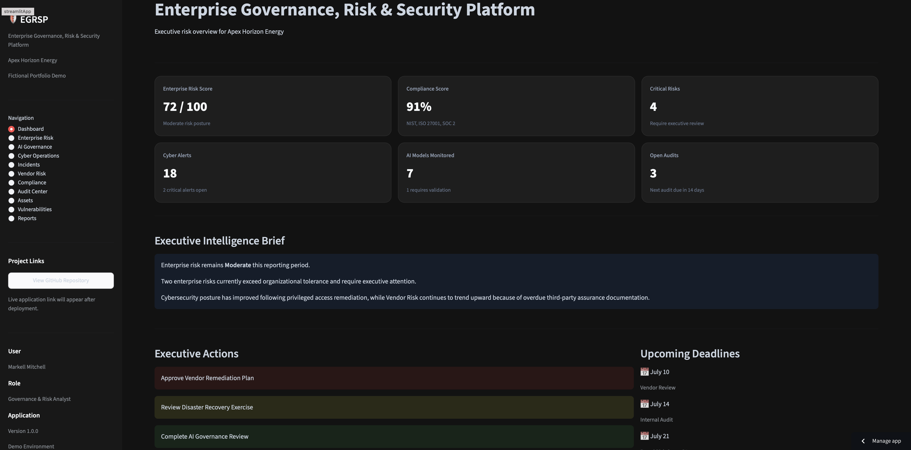
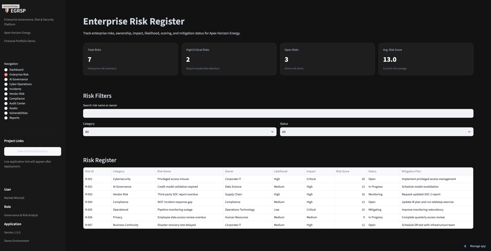

# Enterprise Governance, Risk & Security Platform

[](https://www.python.org/)
[](https://enterprise-governance-risk-security-platform-dqhpu9lzvgm8qtrsf.streamlit.app/)
[](#)
[](#)

A modular Enterprise Governance, Risk, Compliance (GRC), and Information Security platform developed with Python and Streamlit.

The platform demonstrates how an organization can centralize enterprise risk, cybersecurity operations, compliance monitoring, vulnerability management, audit activity, AI governance, third-party risk, asset management, incident response, and executive reporting within a single executive dashboard.

---

## Live Application

**Live Streamlit Application**  
https://enterprise-governance-risk-security-platform-dqhpu9lzvgm8qtrsf.streamlit.app/

**GitHub Repository**  
https://github.com/markell2023/enterprise-governance-risk-security-platform

---

## Application Preview

### Executive Dashboard



### Enterprise Risk Register



---

## Project Overview

The Enterprise Governance, Risk & Security Platform was created to demonstrate how cybersecurity, information assurance, governance, and business-risk information can be consolidated into a single executive decision-support application.

The application helps answer questions such as:

- What are the organization’s highest enterprise risks?
- Which vulnerabilities require immediate remediation?
- Which security incidents are currently active?
- Are critical vendors properly assessed?
- Which compliance controls remain incomplete?
- Which audit findings require leadership attention?
- Are enterprise AI systems properly governed?
- Which assets create lifecycle or security exposure?
- What should executive leadership prioritize next?

---

## Application Modules

### Executive Dashboard

Provides leadership with a consolidated view of:

- Enterprise risk posture
- Compliance performance
- Critical risks
- Cybersecurity activity
- AI governance
- Audit activity
- Executive actions
- Upcoming deadlines

### Enterprise Risk

Includes:

- Enterprise risk register
- Risk ownership
- Likelihood and impact ratings
- Risk scores
- Mitigation plans
- Search and filtering
- Interactive risk heat map

### AI Governance

Tracks:

- Enterprise AI models
- Business units
- Model owners
- Risk classifications
- Validation status
- Governance reviews
- Executive approval requirements

### Cyber Operations

Provides visibility into:

- Security operations activity
- Open incidents
- Critical security events
- Resolution activity
- System health
- Response ownership
- Executive security recommendations

### Incident Management

Tracks:

- Security incidents
- Severity
- Response status
- Incident owners
- MITRE ATT&CK tactics
- Containment status
- Detection dates
- Target resolution dates

### Vendor Risk

Includes:

- Third-party vendor inventory
- Vendor criticality
- Security risk
- SOC 2 documentation status
- Security review status
- Vendor ownership
- Remediation recommendations

### Compliance Center

Tracks controls across:

- NIST Cybersecurity Framework
- ISO 27001
- CIS Controls
- SOC 2

The module includes framework coverage charts, compliance scores, evidence readiness, control filtering, and open compliance gaps.

### Audit Center

Includes:

- Internal and external audit inventory
- Audit status
- Audit ownership
- Open findings
- Finding severity
- Remediation due dates
- Audit filtering
- Executive recommendations

### Asset Inventory

Tracks:

- Enterprise technology assets
- Asset types
- Owners
- Business environments
- Criticality
- Security classifications
- Operating systems
- Lifecycle status
- Last security review dates

### Vulnerability Management

Includes:

- Vulnerability inventory
- CVSS scores
- Severity classifications
- Affected assets
- Remediation owners
- Status
- SLA tracking
- Target remediation dates
- Severity visualization

### Executive Reports

Provides:

- Enterprise security scorecard
- Security domain performance
- Report library
- Scheduled reports
- CSV export center
- Executive recommendations

---

## Key Features

- Eleven functional governance and security modules
- Modular Python architecture
- Reusable KPI card component
- Professional enterprise interface
- Interactive Plotly visualizations
- Enterprise risk heat map
- Search and filtering capabilities
- Executive intelligence summaries
- Governance and remediation recommendations
- Downloadable CSV reports
- Responsive Streamlit layout
- Fictional enterprise security dataset

---

## Technologies Used

- Python
- Streamlit
- Pandas
- Plotly
- HTML
- CSS
- Git
- GitHub

---

## Project Structure

```text
enterprise-governance-risk-security-platform/
│
├── app.py
├── README.md
├── requirements.txt
│
├── assets/
│   ├── dashboard.png
│   └── enterprise-risk.png
│
├── modules/
│   ├── __init__.py
│   ├── executive_dashboard.py
│   ├── executive_intelligence.py
│   ├── enterprise_risk.py
│   ├── risk_heatmap.py
│   ├── ai_governance.py
│   ├── cyber_operations.py
│   ├── incidents.py
│   ├── vendor_risk.py
│   ├── compliance.py
│   ├── audit_center.py
│   ├── assets.py
│   ├── vulnerabilities.py
│   ├── reports.py
│   └── ui_components.py
│
└── theme/
    ├── __init__.py
    ├── colors.py
    └── styles.py

    ---

## Skills Demonstrated

- Governance, Risk, and Compliance (GRC)
- Information Assurance
- Enterprise Risk Management
- Cybersecurity Operations
- Incident Response
- Vulnerability Management
- Third-Party Risk Management
- AI Governance
- Audit Management
- Compliance Monitoring
- Asset Security
- Security Metrics & KPI Reporting
- Executive Dashboard Development
- Python Application Development
- Streamlit Development
- Pandas Data Analysis
- Plotly Data Visualization
- Modular Software Architecture
- Git & GitHub Version Control

---

## Portfolio Disclaimer

This application is a fictional portfolio project created for educational and professional demonstration purposes.

Apex Horizon Energy is a fictional organization. All risks, incidents, vendors, assets, audit findings, compliance data, security events, AI models, and performance metrics are simulated.

Any references to cybersecurity frameworks, vendors, technologies, or organizations are for demonstration purposes only and do not represent actual assessments, security findings, business relationships, or endorsements.